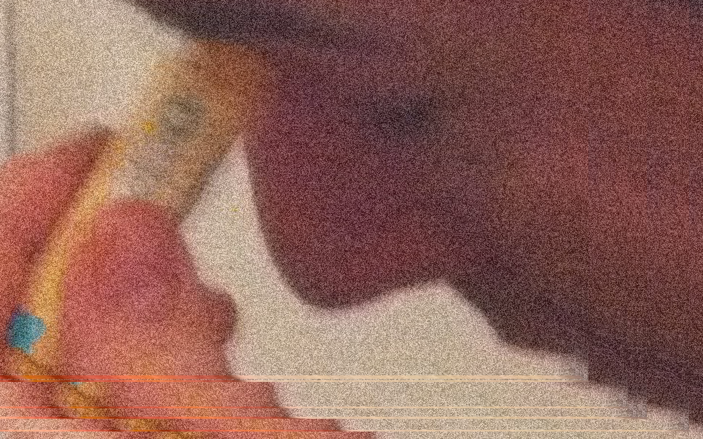

# Pensive Spectation

Three _work-in-progress_ applications to help you look at your images differently.

* Sketch 1 - Re-positions image based on mouse position
* Sketch 2 - Scales image based on user input (press 1, 2, or 3)
* Sketch 3 - Adds noise through randomizing pixel color values  

## Google Reminds Me

## Results 

